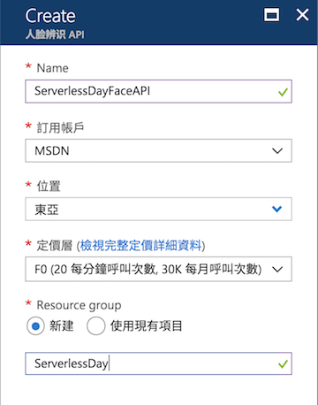
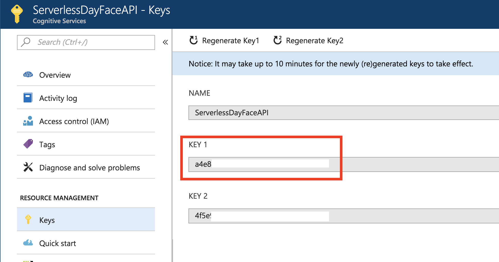
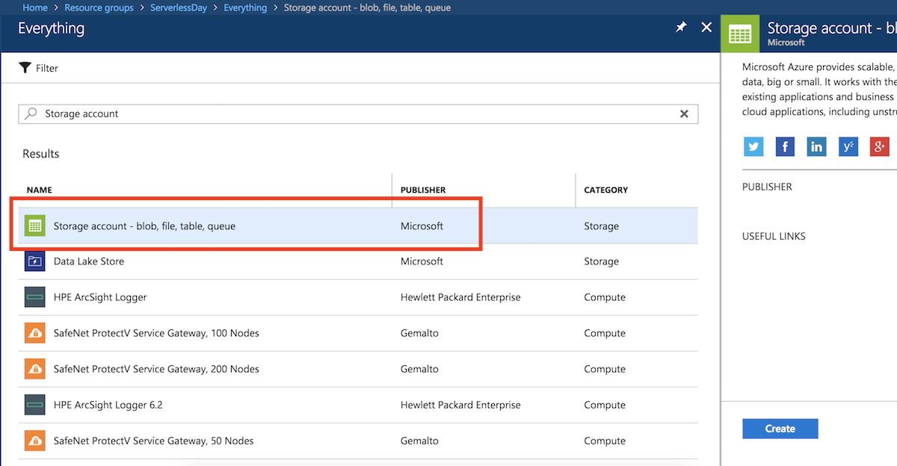
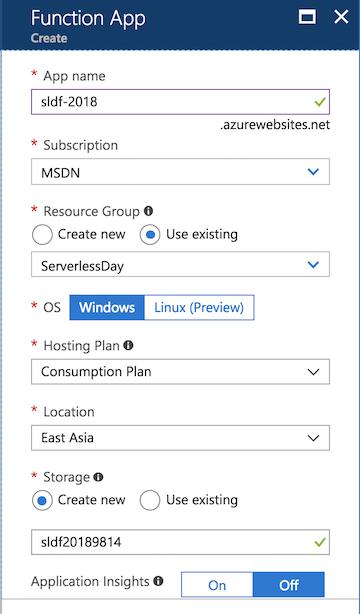
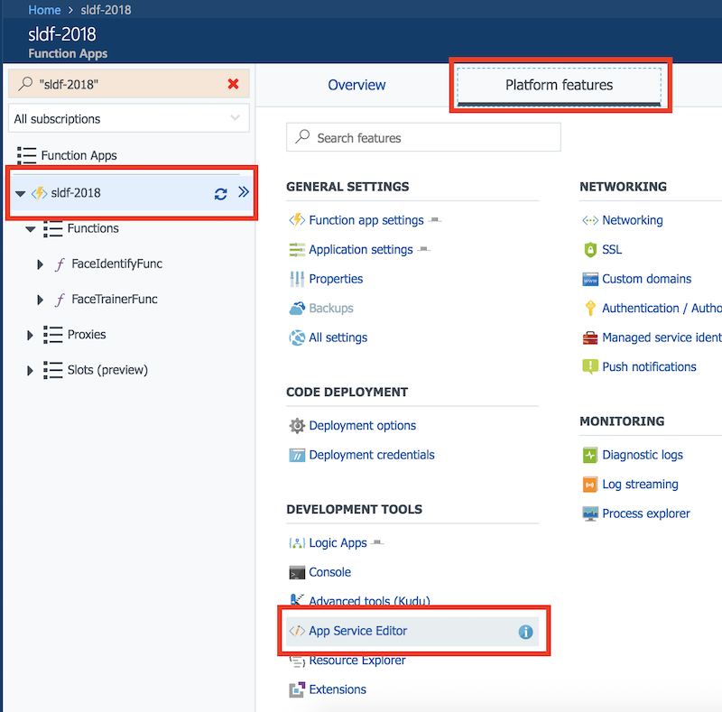
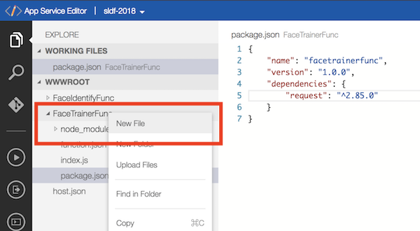
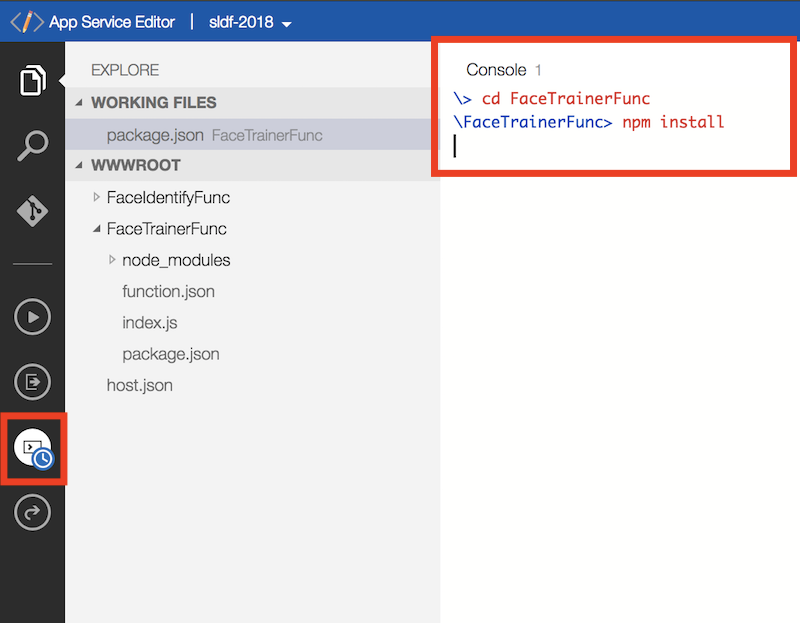

# Face Identification Service

In this lab, we would use [Azure Congnitive Services: Face APIs](https://azure.microsoft.com/zh-tw/services/cognitive-services/face/) to handle the faces and identification processes. The [Azure Functions](https://azure.microsoft.com/zh-tw/services/functions/), a serverless application platform on Azure, would orchestrate the whole process.

## Goal

- Create an online custom face identification services from scratch.
- Be familiar with Azure Functions.
- Be familiar with Azure Congnitive Services.

## Prerequisites

- A Microsoft Azure subscription. (Trial account is also fine) [Sign up for free](https://azure.microsoft.com/zh-tw/free/).
- [Azure Storage Explorer](http://storageexplorer.com/) for manipulating Cosmos DB and Storage account.
- Prepare some photos for training and verifications.
- (optional) Node.js for Azure Function local runtime.

## Steps

### Claim a Face API Access Key

1. Login [Azure portal](https://portal.azure.com/), and click **+ Create a resource (+ 建立資源)**  at the top-left corner. Search for **Face API** and select the item which is _published by Microsoft_.

   

2. On the creation blade:

    a. You can use the name you want or type _ServerlessDayFaceAPI_ in the **Name** field.
    
    b. **Location** could be _East Asia_.
    
    c. Select _F0_ in the **Pricing tier** for leveraging the free quota.
    
    d. Finally, type _ServerlessDay_ in the **Resource group** field.
    
    e. Click the **Create** button on the bottom.

   

3. After successfully created, navigate to the Face API resource you've just created. Go to the **Keys** section to retrieve your access keys.

   > If the keys are accidentally leaked to public or hacked by others. You can also **regenerate** the keys in this section.

    

### Create Services with Azure Functions

#### Set Up the Fundamental Resources

1. Login [Azure portal](https://portal.azure.com/), and create a **Azure Storage account** for storing the photo of faces. Select the _Storage account_ published by _Microsoft_.

   

2. For creating the storage account:

    a. Type a unique name in **Name** field
    
    b. Set **Deployment model** to _Resource manager_
    
    c. Use _Storage V2_ as the **Account kind**.
    
    d. Set **Performance** to _Standard_
    
    e. Use _LRS_ in the **Replication** field
    
    f. Use _Hot_ in **Access tier**
    
    g. _Enable_ the **Secure transfer required**.
    
    h. Use the same **Resource group** and **Location** with Face API.

    i. Click **Create** button to start creation.

   

3. Now, let's create a **Cosmos DB** instance for storing the meta data of the faces. Click the **+ Create a resource** and search for the _Cosmos DB_.

   

4. For creating the Cosmos DB:

    a. Type a unique name in the **ID** field. It determines the URL of the Cosmos DB instance.
    
    b. Select _MongoDB_ in **API** field (_SQL_ is recommended if you use C#/.NET as programming language).
    
    c. Use the same **Resource group** and **Location** as previous resources.

    d. Click **Create** button to start creation.

   

5. Now we start to create the Azure Function app. Click **+ Create a resource (+ 建立資源)**  at the top-left corner. Search for **Function App** and select the item which is _published by Microsoft_.

   

6. For creating the Function app:

    a. Set a unique name in **Name** field.
    
    b. Select the same **Resource group** with the Face API, too.
    
    c. Use _Consumption Plan_ in the **Hosting plan**.
    
    d. **Location** is set to the same region of the Face API, could be _East asia_.
    
    e. The others are left default values.

    f. Click **Create** button to start creation.

   

#### Creating the Face Trainer Service

1. Navigate to the Function app, click the **+** (create new) at the Functions tab and click the **create your own custom function** link to create a new function.

   

2. Select _JavaScript_ (or _C#_) in the **Language** box and _Data Processing_ in the **Scenario** box. Then, choose the _Cosmos DB trigger_ with _JavaScript_ (or _C#_).

   

3. Now you can set up the properties to create the Cosmos DB triggered function:

    a. Type _FaceTrainerFunc_ (or any name you like) in the **Name** field.

    b. Select or click the _new_ link at **Azure Cosmos DB account connection** field to connect the Cosmos DB you've just created.

    c. Type _faces_ in the **Collection name** field.

    d. Type _users_ in the **Database name** field.

    e. Click the **Create** button to start creation.

   

4. Paste the following code segment to the **index.js**.

    ```javascript
    const request = require('request');

    const FACE_API_ENDPOINT = 'https://eastasia.api.cognitive.microsoft.com/face/v1.0';
    const FACE_API_KEY = '';
    const PERSON_GROUP_ID = 'ServerlessDayPersonGroup';
    const PERSON_GROUP_NAME = 'Serverless Day 工作坊群組';

    const PERSON_GROUP_ENDPOINT = `${FACE_API_ENDPOINT}/persongroups/${PERSON_GROUP_ID}`;

    module.exports = function (context, documents) {
        if (!!documents && documents.length > 0) {

            let pgId, pId;

            // check the person group first.
            ensurePersonGroupAsync(context)
                .then((personGroupId) => {
                    // store the personGroupId.
                    pgId = personGroupId;

                    let addingFacesPromises = [];
                    documents.forEach(document => {
                        addingFacesPromises.push(
                            ensurePersonAsync(context, pgId, document)
                                .then((person) => {
                                    context.log(`[Person] Adding persisted faces...${pgId}/${person.faces}`);
                                    addPersistedFacesAsync(context, pgId, person.personId, person.faces);
                                })
                        );
                    });

                    return Promise.all(addingFacesPromises);
                })
                .then(() => {
                    context.log('[Final] Training person group...');
                    // Invoking the train request to the person group.
                    request({
                        url: `${PERSON_GROUP_ENDPOINT}/train`,
                        method: 'POST',
                        headers: {
                            'Ocp-Apim-Subscription-Key': FACE_API_KEY
                        }
                    }, () => {
                        context.log('Done.')
                        context.done(); 
                    });
                });
        } else {
            context.done();
        }
    }

    function ensurePersonGroupAsync(context) {
        return new Promise((resolve, reject) => {
            context.log('[PersonGroup] Check if the person group is created...');

            // compose the request.
            let reqOpt = {
                url: PERSON_GROUP_ENDPOINT,
                method: 'GET',
                headers: {
                    'Ocp-Apim-Subscription-Key': FACE_API_KEY
                },
                json: true
            };

            request(reqOpt, (err, response, body) => {
                if (body.error) {
                    context.log(`[PersonGroup] Person group ${PERSON_GROUP_ID} does not exist. Start creating a new one...`);

                    // create a new person group
                    let reqCreatePG = {
                        url: PERSON_GROUP_ENDPOINT,
                        method: 'PUT',
                        body: {
                            'name': PERSON_GROUP_NAME
                        },
                        headers: {
                            'Content-Type': 'application/json',
                            'Ocp-Apim-Subscription-Key': FACE_API_KEY
                        },
                        json: true
                    };
                    request(reqCreatePG, () => { 
                        context.log("[PersonGroup] Successfully created.")
                        resolve(PERSON_GROUP_ID); 
                    });
                } else {
                    context.log(`[PersonGroup] Person group ${PERSON_GROUP_ID} has existed.`);
                    resolve(PERSON_GROUP_ID);
                }
            });
        });
    }

    function ensurePersonAsync(context, personGroupId, person) {
        return new Promise((resolve, reject) => {
            context.log(`[Person] Check if the person ${person.personId} existed...`);

            let urlPerson = `${PERSON_GROUP_ENDPOINT}/persons/${person.personId}`;

            let reqCheck = {
                url: urlPerson,
                method: 'GET',
                headers: {
                    'Ocp-Apim-Subscription-Key': FACE_API_KEY
                },
                json: true
            };
            request(reqCheck, (err, response, body) => {
                if (body.error) {
                    context.log('[Person] Person does not exist. Start creating a new one...');
                    let reqCreate = {
                        url: urlPerson,
                        method: 'POST',
                        headers: {
                            'Content-Type': 'application/json',
                            'Ocp-Apim-Subscription-Key': FACE_API_KEY
                        },
                        body: {
                            'name': person.name
                        },
                        json: true
                    };
                    request(reqCreate, () => {
                        resolve(person);
                    });
                } else {
                    context.log('[Person] Person exists.');
                    resolve(person);
                }
            });
        });
    }

    function addPersistedFacesAsync(context, personGroupId, personId, faces) {
        let addFacePromises = [];
        faces.forEach(face => {
            context.log(`[AddPersistedFaces] Adding ${face}`);
            addFacePromises.push(
                addPersistedFaceAsync(context, personGroupId, personId, face)
            );
        });
        return Promise.all(addFacePromises);
    }

    function addPersistedFaceAsync(context, personGroupId, personId, face) {
        new Promise((resolve, reject) => {
            context.log('[AddPersistedFace] Adding person face...');

            let reqAdd = {
                url: `${PERSON_GROUP_ENDPOINT}/persons/${personId}/persistedFaces`,
                method: 'POST',
                headers: {
                    'Content-Type': 'application/json',
                    'Ocp-Apim-Subscription-Key': FACE_API_KEY
                },
                body: {
                    'url': face
                },
                json: true
            };
            request(reqAdd, (err, response, body) => {
                context.log('[AddPersistedFace] Successfully added.');
                resolve(body.persistedFaceId);
            });
        });
    }
    ```

5. Before we execute this function, if you use Node.js you have to restore the npm packages first. Navigate to the Function App's **Platform features** and click the **App Service Editor**.

   

6. In App Service Editor, right click the `FaceTrainerFunc` folder to add a new file called _package.json_. 

   

   Paste the code segment:

   ```javascript
   {
       "name": "facetrainerfunc",
       "version": "1.0.0",
       "dependencies": {
           "request": "^2.85.0"	
       }
   }
   ```

7. Open the console in the App Service Editor by clicking the console icon on the leftmost panel.

   

   and type this commands in console:

   ```cmd
   \> cd FaceTrainerFunc
   \FaceTrainerFunc> npm install
   ```

   After successfully installed the packages, you can close the App Service Editor and go back to the Function App portal.

8. Test the function with following steps:

    a. Upload the face photo to the storage account you created at beginning. Put the file under `train/` container.

    b. Get the SAS for the photo in order to access is via URL.

    c. Run the function with the following test data (simulated Cosmos DB data in `faces` collection):

    ```json
    [
        {
            "id": "1",
            "personId": "<PERSON_ID>",
            "name": "<Name of the Person>",
            "faces": [
                "[THE PHOTO URL 1]",
                "[THE PHOTO URL 2]",
                ...
            ]
        }
    ]
    ```

    d. Check the log window under the function editor to see if it works correctly.